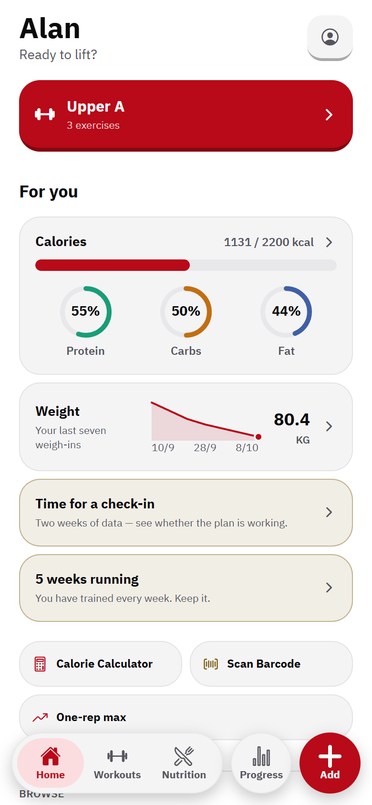
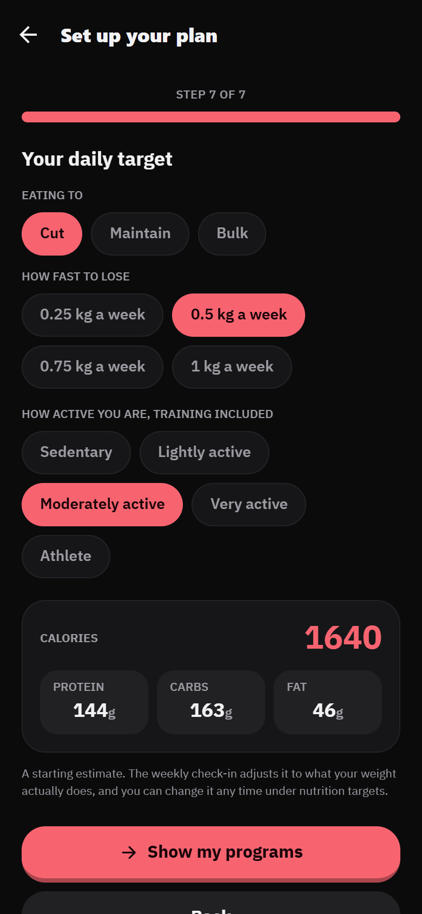
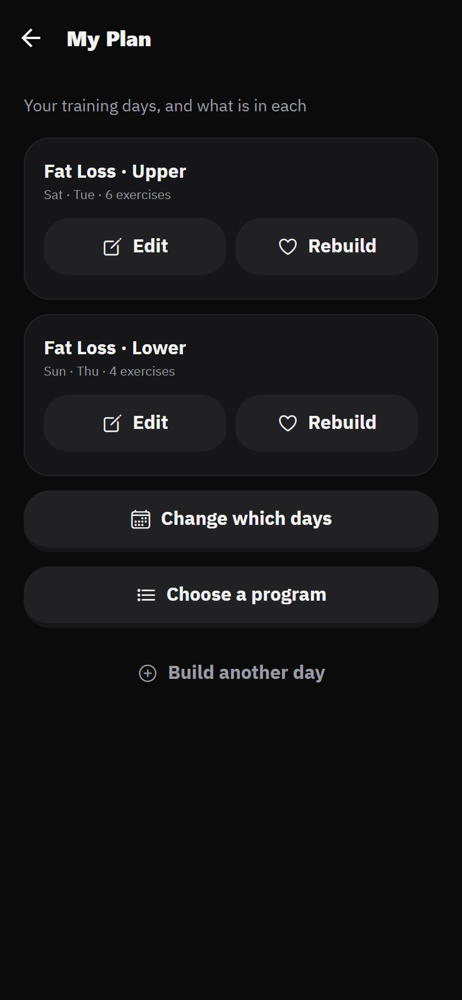
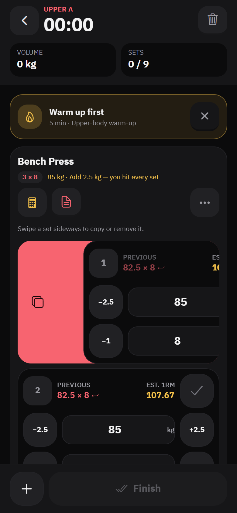
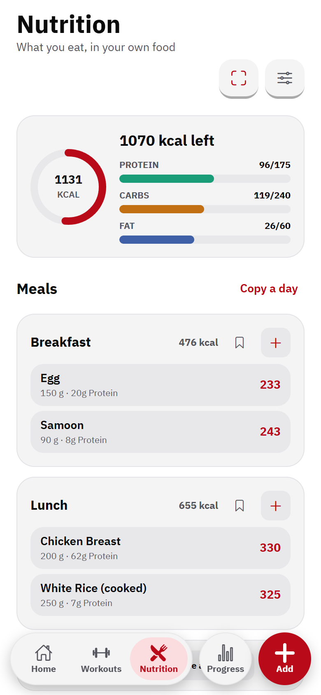
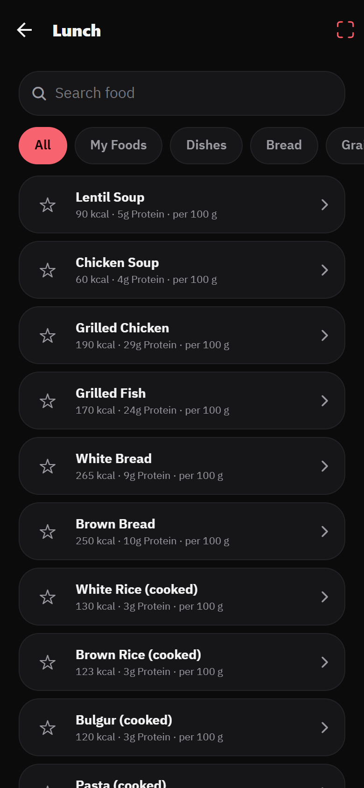
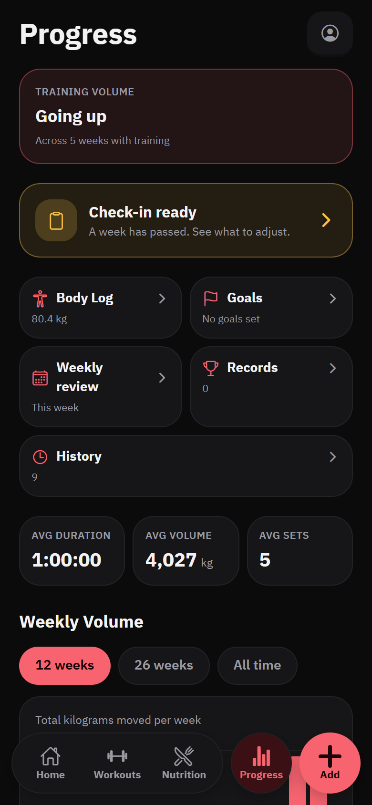
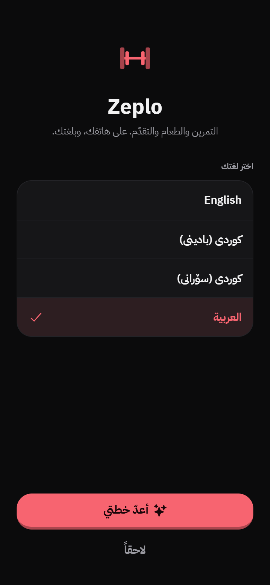
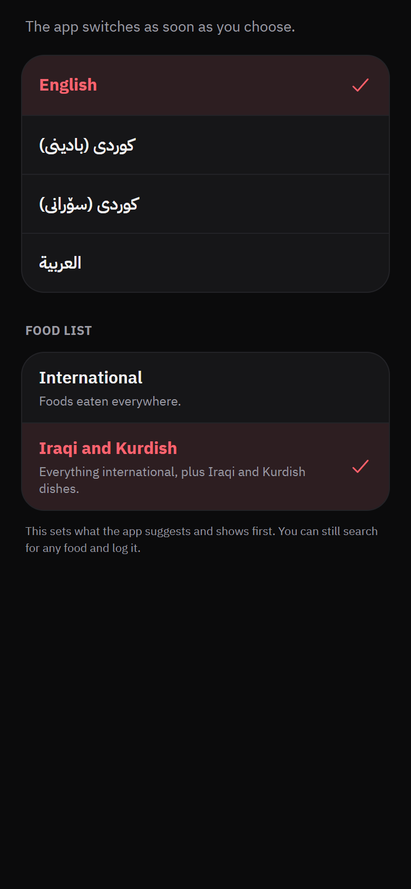

# Zeplo

**A training, nutrition and body-tracking app that works with no account, no server and no data leaving the phone. Built in Iraqi Kurdistan, for anywhere.**

**[Try the live demo](https://omargh99.github.io/zeplo-showcase/)** (best on a phone, or a narrow browser window)

Zeplo is in development and launching soon. This repository is a showcase: screenshots, a browser demo, the thinking behind the product, and how it is built. The app's source is private.

  
  
  
  

## Why it exists

Most fitness apps assume an English-speaking user, an always-on connection, a Western diet and an account. Gyms in Kurdistan are not that. Members read Kurdish (two written forms) or Arabic, many are on patchy data, the food is kofta, dolma, rice and flatbread, and Ramadan changes how a day is eaten and trained.

Zeplo started there and kept three promises as it widened:

- **Your data stays on your phone.** No sign-in, no backend, no analytics. Progress photos never leave the device. A new phone restores from a backup file you export yourself.
- **Nothing is behind a paywall.** There is no paid tier.
- **It fits where you are.** Languages and the food list follow the phone's region, and both can be changed.

## What it does

**Training**
- 32 programmes, recommended from a short set of questions: goal, experience, equipment, days a week and session length.
- Programmes adjust for an injury or for training at home. Before you agree, the app lists what happens to each lift: swapped for what, or left out.
- Progressive overload built in: the start sheet opens at today's target weight, and the rest timer follows the programme.
- Swipe a set to copy or remove it. The screen stays on while you train.
- Warm-ups, mobility and posture routines, with a demonstration for each exercise.
- Sport sessions (padel, football, volleyball, boxing, swimming and others) logged with a calorie estimate.
- Import a training history from Strong, Hevy or FitNotes. The file is read on the phone.

**Nutrition**
- Calorie and macro targets from your body and goal, with a choice of pace and floors that refuse to go below what needs medical supervision.
- 21 two-week eating plans, ordered for your diet and goal, and rewritten automatically for allergies.
- An international food list of 159 foods, with 62 Iraqi and Kurdish dishes and staples added in Iraq. Outside the chosen list a food is not suggested, but a search still finds it.
- Fried, processed and feast foods are never recommended, only logged.
- Barcode scanning, favourite foods, one-tap snacks and "same as last time".
- Ramadan mode, with suhoor and iftar in place of breakfast and dinner.

**Body**
- Weigh-ins, measurements, goals and private progress photos.

**Everywhere**
- English worldwide; Arabic across the Arabic-speaking countries; Kurdish (Badini and Sorani) in Iraq. Three of the four are right to left, and the layout is mirrored throughout.
- Dark and light themes. A floating tab bar with an Add button that logs a workout, food, a weigh-in or a sport session from any screen.

## Screens

| | | |
|---|---|---|
|  Setup ends with your own calorie target |  Programmes recommended from your answers |  What adjusting for a knee will change |
|  Your plan, day by day |  Swipe a set to copy or remove it |  Weekly review |
|  Nutrition, light theme |  The international food list |  A plan rewritten for a nut allergy |
|  Calorie targets with a pace |  Add, from any screen |  Progress |
|  First launch in Iraq: four languages |  Language and food list |  Weekly review in Kurdish (Sorani) |

Screenshots are from the web build at phone size, with sample data.

## The demo

The demo is the real app, built for the browser. It starts empty, as a new install does, and keeps what you enter in that browser only.

A browser cannot do everything a phone can. The camera and barcode scanner, notifications, the share sheet and the home-screen widget are not in the demo.

## How it is built

| | |
|---|---|
| App | React Native 0.86 and Expo SDK 57, TypeScript |
| Navigation | expo-router (file-based, typed routes) |
| Styling | NativeWind (Tailwind for React Native), themed through CSS variables |
| State | One Zustand store, persisted to AsyncStorage |
| Languages | Four, in one dictionary, with direction handled by a single hook |
| Platforms | iOS and Android, plus an Android home-screen widget |

A few decisions worth reading about:

- **Offline by construction.** There is no server to be down, and no data to leak or sell. The two network calls in the app, a barcode lookup and opening a YouTube search, are user-initiated and carry no identity. The region is read from the phone's own settings, not looked up.
- **Storage that survives years of use.** One storage key would have passed 2 MB after about three years of heavy logging, which older Android phones cannot read back from a single row. History and food logs are sharded by month and only changed months are rewritten.
- **Migrations before changes.** A saved-data version bump with no upgrade step would erase every user's history on the next launch. A check script refuses that change.
- **Failures are values, not exceptions.** Anything that can fail because of the network or the user returns a result with a small reason code, mapped to a translated message. The UI never shows a raw platform error.
- **Backup is a file, not a service.** A validated snapshot goes through the system share sheet. Photos are excluded from it on purpose.
- **Hand-written tables over clever matching.** Food swaps, exercise stand-ins and import name matching are written row by row. Matching on numbers alone once turned milk into hummus.

## How it is tested

There is no test framework. Instead there are **24 check scripts, each written against a failure that really happened**, run together with the type checker and linter on every change. Some of what they hold:

- **Targets:** about 60,000 combinations of sex, age, height, weight, activity, goal, pace and diet, run through the real calculation. None may land below a safe calorie floor or break its macro maths.
- **Diet plans:** a plan may not name a food that does not exist, serve fried or feast food, keep an allergen after being rewritten for that allergy, or name an Iraqi dish outside Iraq.
- **Programmes:** a card may not promise more days than adopting it schedules, and what the adjust dialog says must be what adjusting does.
- **Languages:** a key present in one language and missing in another is a build failure, including keys built at run time.
- **Numbers:** a typed "82.5" or "82٫5" with an Arabic decimal mark must be stored as 82.5, never 825.
- **Colour:** every palette colour is checked for WCAG contrast on the surfaces it sits on, in both themes.
- **Erase everything:** the reset must leave no stored field, photo, reminder or old copy behind.

On top of those, a browser harness drives the built app at phone size: 94 on-screen checks, including a full first run from an empty phone, and seven different people walked from setup to a finished workout in their own language and region.

## Design process

The app went through a written design audit and a first-run review before launch. The first-run review walked the app as somebody who had just installed it and found eighteen defects that were invisible from a phone full of data, including one where a single tap replaced an adopted programme. Each has a check that fails if it returns.

## Status

In development. Pre-launch work in progress: testing on real devices, native-speaker review of the Kurdish and Arabic text, a coach's review of the programmes, and the store listing.

## Contact

Built by [omarGH99](https://github.com/omarGH99).

---

All rights reserved. The screenshots and text in this repository may be shared with attribution; the application and its source code are not open source.
