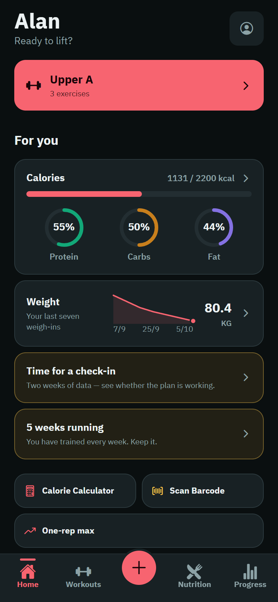
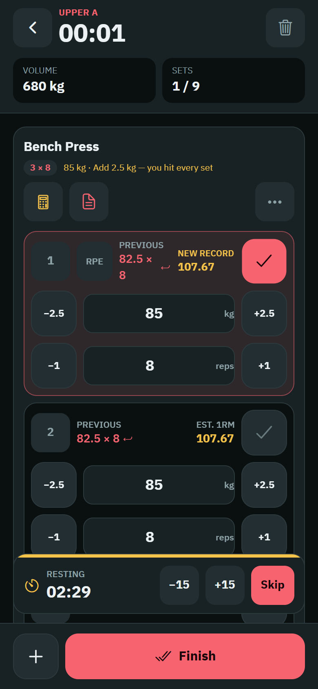
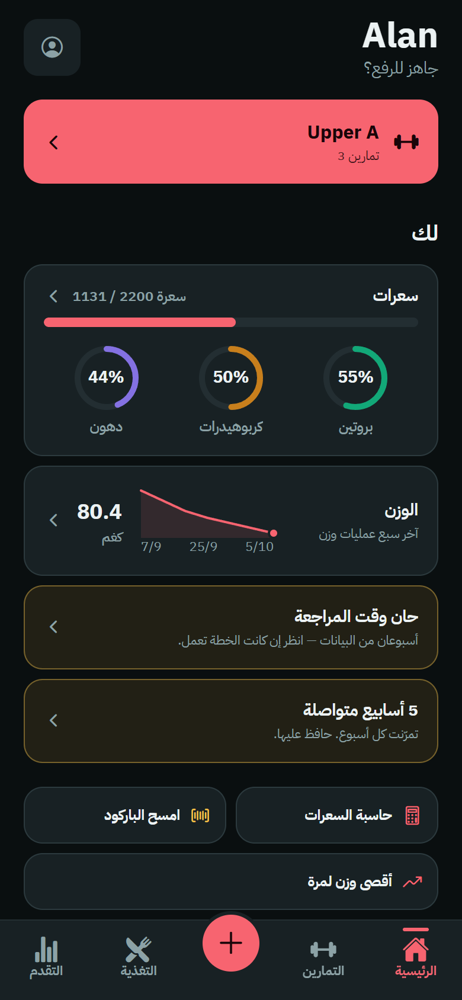
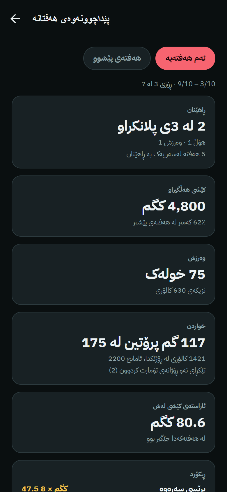
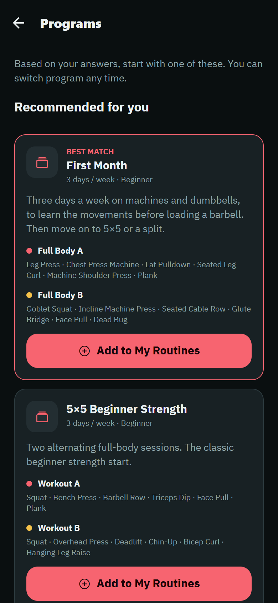
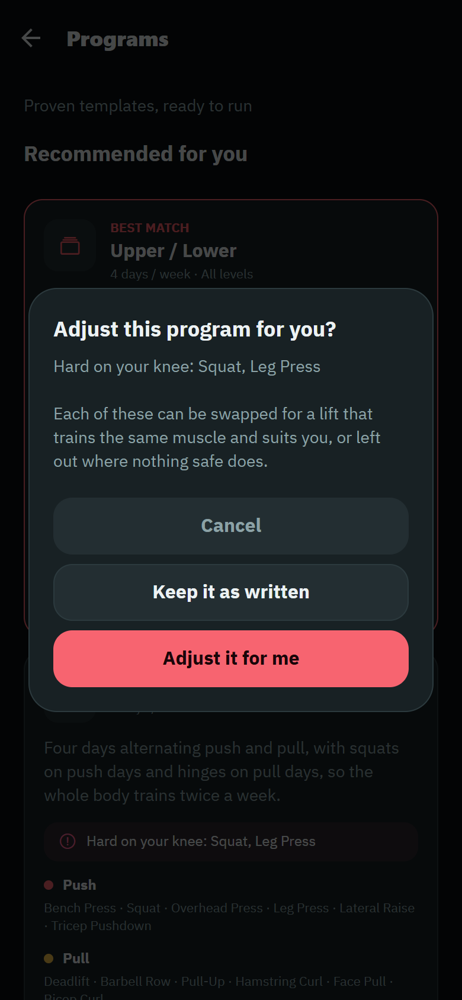
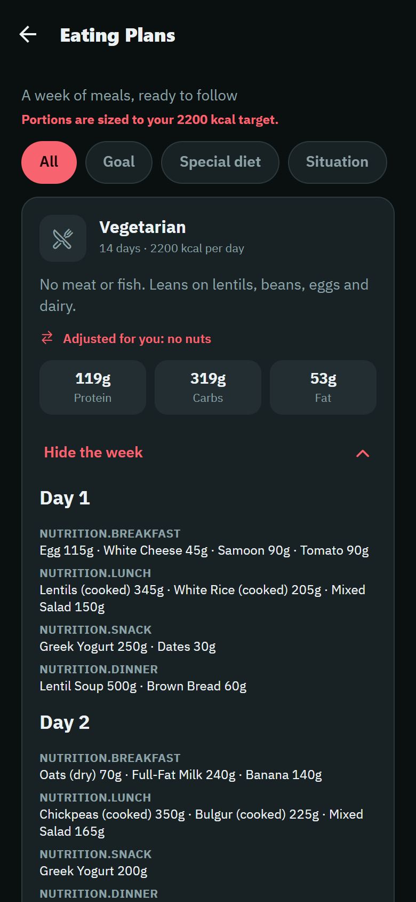
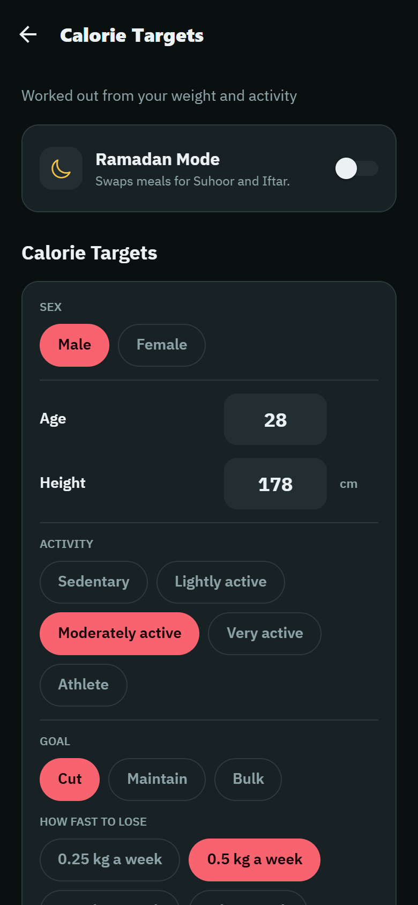
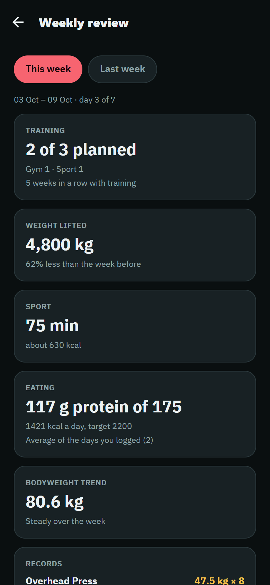
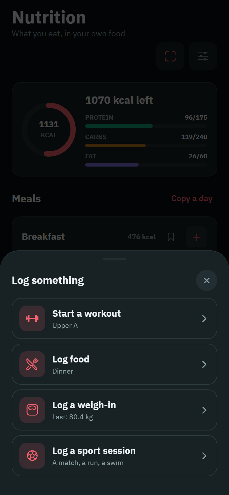

# Zeplo

**A training, nutrition and body-tracking app for gyms in Iraqi Kurdistan, built to work with no account, no server and no data leaving the phone.**

Zeplo is in development and launching soon. This repository is a showcase: screenshots, the thinking behind the product, and how it is built. The app's source is private.

  
  
  
  

## Why it exists

Most fitness apps assume an English-speaking user, an always-on connection, a Western diet and an account. Gyms in Kurdistan are not that. Members read Kurdish (two written forms) or Arabic, many are on patchy data, the food is kofta, dolma, rice and flatbread rather than chicken and broccoli, and Ramadan changes how a day is eaten and trained.

Zeplo is built around that, and around one promise: **your data stays on your phone.** There is no sign-in, no backend and no analytics. Progress photos never leave the device. A new phone restores from a backup file you export yourself.

## What it does

**Training**
- Workout programmes recommended from a short set of questions: goal, experience, equipment, days per week and session length.
- Programmes adjust for an injury (a bad knee, a sore lower back) or for training at home, swapping lifts for sensible stand-ins instead of leaving holes.
- Progressive overload built in: the start sheet opens at today's target weight, and the rest timer follows the programme.
- Warm-ups, mobility and posture routines, with a demonstration for each exercise.
- Sport sessions (padel, football, volleyball, boxing, swimming and others) logged with an honest calorie estimate.
- A weekly review you can share as an image.

**Nutrition**
- Calorie and macro targets from your body and goal, with a choice of pace and safety floors that refuse to go below what needs medical supervision.
- Diet plans written around local food, adapted automatically for allergies and for named diets such as keto.
- Meal suggestions that make cultural sense: no quzi at breakfast.
- Barcode scanning, favourite foods, and "same as last time" for repeat meals.
- Ramadan mode with suhoor and iftar in place of breakfast and dinner.

**Body**
- Weigh-ins, measurements, goals and private progress photos.

**Everywhere**
- Four languages: English, Kurdish (Badini), Kurdish (Sorani) and Arabic. Two of them are right to left, and the layout is mirrored throughout rather than patched.
- Dark and light themes. A one-tap "+" in the tab bar logs a workout, food, a weigh-in or a sport session from any screen.

## Screens

| | | |
|---|---|---|
|  Programmes recommended from your answers |  Adjusted for a knee limitation |  A diet plan adapted for a nut allergy |
|  Calorie targets with a pace |  Weekly review |  Quick add from the tab bar |

Screenshots are from the web build at phone size, with sample data.

## How it is built

| | |
|---|---|
| App | React Native 0.86 and Expo SDK 57, TypeScript |
| Navigation | expo-router (file-based, typed routes) |
| Styling | NativeWind (Tailwind for React Native), themed through CSS variables |
| State | One Zustand store, persisted to AsyncStorage |
| Languages | Four, in one dictionary, with direction handled by a single hook |
| Platforms | iOS and Android, plus an Android home-screen widget |

A few decisions worth reading about:

- **Offline by construction.** There is no server to be down, and no data to leak or sell. The two network calls in the app, a barcode lookup and opening a YouTube search, are user-initiated and carry no identity.
- **Storage that survives years of use.** One storage key would have passed 2 MB after about three years of heavy logging, which older Android phones cannot read back from a single row. History and food logs are therefore sharded by month and only changed months are rewritten.
- **Migrations before changes.** A saved-data version bump with no upgrade step would erase every user's history on the next launch. A check script refuses that change.
- **Failures are values, not exceptions.** Anything that can fail because of the network or the user returns a result with a small reason code, mapped to a translated message. The UI never shows a raw platform error.
- **Backup is a file, not a service.** A validated snapshot goes through the system share sheet. Photos are excluded from it on purpose.

## How it is tested

There is no test framework. Instead there are **18 check scripts, each written against a failure that really happened**, run together with the type checker and linter on every change. Some of what they hold:

- **Targets:** every combination of sex, age, height, weight, activity, goal, pace and diet, about 60,000 profiles, run through the real calculation. None may land below a safe calorie floor, break its macro maths, or give a keto diet a normal carbohydrate target.
- **Diet plans:** a plan may not name a food that does not exist, serve a food outside its meal, repeat something more often than anyone eats it, or keep an allergen after being adapted for that allergy.
- **Programmes:** a card may not promise more days than adopting it schedules, and a programme adjusted for an injury may not still hold the lift it removed.
- **Languages:** a key present in one language and missing in another is a build failure, not a silent fallback to English in the middle of an Arabic screen.
- **Numbers:** a typed "82.5" or "82٫5" with an Arabic decimal mark must be stored as 82.5, never 825.
- **Colour:** every palette colour is checked for WCAG contrast on the surfaces it sits on, in both themes.
- **Erase everything:** the reset must leave no stored field, photo, reminder or old copy behind.

Behavioural claims get a throwaway proof script that seeds a state and asserts the outcome, with the real numbers kept in the commit message.

## Design process

The app went through a written design and UX audit before launch: a prioritised list of problems found at phone sizes from 320 pt up, in both themes and both text directions, followed by fixes to type sizes, shared form components, navigation and accessibility.

## Status

In development. Pre-launch work in progress: store listing, privacy policy, and native-speaker review of the Kurdish and Arabic text.

## Contact

Built by [omarGH99](https://github.com/omarGH99).

---

All rights reserved. The screenshots and text in this repository may be shared with attribution; the application and its source code are not open source.
